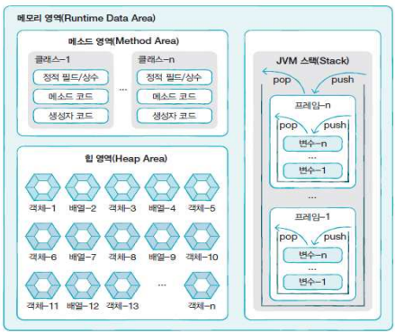
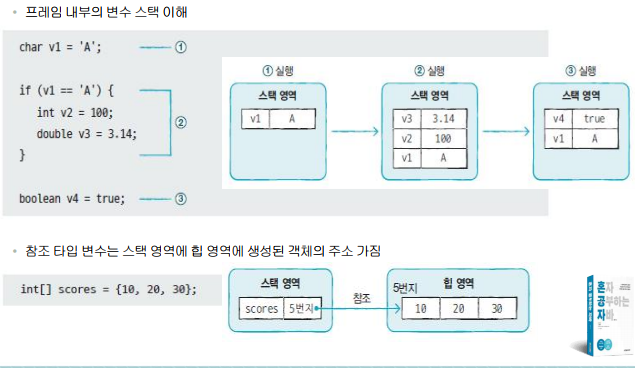

## 메모리 사용 영역

- 메소드 영역 : 클래스별로 코드들을 분류해 저장
  1. 정적 필드(static field)
  2. 상수 (constant)
  3. 생성자(constructor)
  4. 메소드(method)

- 힙 영역 : 객체와 배열이 생성되는 영역

- JVM 스택 영역 
  1. 메소드가 호출되면 프레임이 추가되고
  2. 메소드 종료되면 프레임이 제거됨
  3. 프레임 내부의 변수 스택 이해
     
  

## 메서드 정의
- 제어자(Modifier) : public, static
- 리턴타입(Return Type) : 메서드가 실행된 뒤 반환되는 타입
- 메서드이름(Method Name) : 메서드를 호출하는데 사용됨. 기능이 드러나도록 이름을 짓는 것이 좋다.
- 매개변수(parameter) : 입력 값, 메서드 내부에서 사용 가능한 변수, 매개변수가 없을 수도 있음
- 메서드 본문(Method Body) : 실행되는 코드 블록. {} 사이 위치

## 메서드의 장점
1. 반복되는 코드의 중복을 줄일 수 있다
2. 작업이 분리되어 코드의 가독성이 향상된다
3. 코드를 다른 프로그램에서 재사용할 수 있다
4. 기존의 기능을 확장해서 사용하는데 유용하다
5. 메서드를 사용할 때는 내부 작업, 구현부에 대해 알 필요 없이 사용할 수 있다
6. 모듈화된 메서드는 개별적으로 테스트하고 디버깅할 수 있다
7. 유지보수가 용이해진다

## 메서드 명명 규칙
- 기본적으로 변수의 이름을 붙이는 방식과 같다 (CamelCase 등)
- 메서드의 이름에는 동사를 사용해서 시작하는 것이 좋다
  - ex) addNumbers : 두 숫자를 더하는 메서드 ← 명시적으로 추측 가능
  - ex) getStudentInfo : 학생의 정보를 가져오는 메서드
  - ex) setEmployeeName : 직원의 이름을 설정하는 메서드
- 일반적으로 널리 사용되지 않는 약어는 사용하지 않는 것이 좋다.
  - addN, getSi, setEn ← 무슨 동작을 하는 메서드인지 추측하기 어렵다

### 👀 추가
- void쓰면 return, 리턴 타입(int, double)은 없다
- void 안쓰면 return, 리턴 타입(int, double같은거) 써야 함
- 하나의 메서드는 하나의 리턴 가지는게 좋음