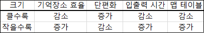

# 운영체제
## 1. 운영체제 기초
### 기억장치
- 데이터, 프로그램, 연산의 중간 결과 등을 일시적 또는 영구적으로 저장하는 장치
- 종류
  1. 레지스터
     - CPU 내부에 위치
     - 접근 시간이 CPU의 처리 속도와 매우 유사
  2. 캐시 메모리 
     - CPU와 주기억장치 사이의 속도 격차를 줄이기 위해 사용
     - 실행 중인 프로그램의 자주 사용되는 명령어와 데이터를 저장
  3. 주기억장치
     - CPU가 직접 접근하여 데이터를 읽고 쓸 수 있는 장치
     - 종류
       - ROM : 읽기 전용, 비휘발
       - RAM : 읽기 쓰기 가능, 휘발, 기억장소를 임의로 접근 가능
         - SRAM : 전원이 공급되는 중에 내용이 사라지지 않음 (캐시 메모리로 사용)
         - DRAM : 일반적인 주기억장치, 일정 시간이 지나면 내용이 사라지는 RAM
  4. 연관기억장치
     - 주소가 아니고, 기억된 내용의 일부를 이용해 접근할 수 있는 장치
     - 내용 기반 검색으로 빠른 검색 속도
     - 캐시 메모리나 가상 메모리 관리 기법에 사용하는 Mapping Table에서도 이 연관 메모리 적용
  5. 보조기억장치
     - 주기억장치에 비해 접근 시간은 느리지만, 기억 용량이 크다
     - ex. HDD, SSD, CD, USB 등
  6. SSD 
     - 기계적인 움직임이 없는 반도체 기반의 저장 장치
### 시스템 소프트웨어
- 응용 소프트웨어를 실행하기 위한 플랫폼 제공
- 컴퓨터 HW의 작동과 접근을 관리
- 종류
  - 로더 : 프로그램을 메모리에 적재
  - 링커 : 목적 파일을 실행 파일로 변환
  - 유틸리티 : 하드웨어, 운영체제, 응용 소프트웨어 관리를 지원 
  - 번역기(어셈블러, 컴파일러) : 특정 프로그래밍 언어를 다른 언어로 변환
  - 장치 드라이버 : 특정 하드웨어나 장치를 제어
  - 운영체제 : 하드웨어 관리와 통신 등 다양한 기능을 제공
- 구성 
  - 제어 프로그램 ( 감 작 데 이 )
    - 감시 프로그램 : 프로그램 실행과 시스템 상태를 감시/감독
    - 작업관리 프로그램 : 스케줄 관리 및 시스템 자원 할당을 담당
    - 데이터 관리 프로그램 : 데이터 전송 및 파일 조작을 관리
  - 장치 프로그램
    - 서비스 프로그램 : 사용 빈도가 높은 프로그램
    - 문제 프로그램 : 특정 업무를 해결하기 위한 프로그램
    - 언어 번역 프로그램 : 어셈블러,  컴파일러, 인터프리터 등 
    
### 운영체제
- 응용 프로그램이 하드웨어를 제어하여 실행될 수 있도록 관리하는 소프트웨어 
- 컴퓨터 시스템의 자원을 효율적으로 관리하며, 사용자가 컴퓨터를 편리하게 사용할 수 있는 환경을 제공
- 기능
  1. 프로세스(실행중인 프로그램) 관리 : 프로세스의 생성, 실행, 관리
  2. 메모리 관리 : 메모리 공간의 할당 및 회수를 관리
  3. 파일 관리 : 파일 시스템 운영 및 파일 저장을 관리
  4. 입출력 관리 : 입출력 장치의 관리를 담당
  5. 보조기억장치 관리 : 보조기억장치의 공간 할당 및 관리를 담당
  6. 네트워킹 : 컴퓨터 통신을 위한 제어 관리를 수행 
  7. 정보 보안 관리 : 사용자 인증 및 실행 권한 관리
  8. 명령해석 시스템
- 운용 기법
  1. 일괄 처리(Batch Processing) : 여러 작업 묶어서 처리
  2. 실시간 처리(Real Time) : 요청 즉시 처리
  3. 다중 프로그래밍 : 하나의 작업이 처리중일 때 다른 작업을 처리
  4. 시분할 : 정해진 시간 동안 작업 실행
  5. 다중 처리(=병렬 처리) : 여러 CPU를 이용해 동시에 여러 작업 처리
  6. 다중 모드 : 다양한 운용기법 혼용해 사용
  7. 분산 처리 : 여러 독립된 시스템이 통신으로 연결되어 상호작용 
- 성능 평가 기준
  1. 처리량 : 일정 시간 내 처리하는 작업의 양
  2. 반환 시간 : (대기시간 + 실행시간 + 응답시간) 작업 요청부터 결과 반환까지 소요 시간
  3. 신뢰도 
  4. 사용 가능도 : 시스템 즉시 사용 가능한 정도
  5. 확장성 : 시스템이 증가하는 부하나 요구사항에 맞춰 적절히 확장되는 능력
  6. 보안 : 기 무 가 유지 능력
  7. 자원 활용도
### 운영체제의 종류
1. 윈도우 : GUI, 선점형 멀티태스킹 방식
2. 리눅스 : 다중 사용자 시스템, 오픈 소스
3. 유닉스 : 커널(UNIX의 핵심, 부팅될 때 주기억장치에 적재된 후 상주하며 실행), 쉘(명령어 해석기), 유틸리티 프로그램(일반 사용자가 작성한 응용 프로그램을 처리하는데 사용), POSIX(이식 가능한 운영체제 인터페이스)
4. MacOS : 애플 개발 유닉스 기반 
### 운영체제별 파일 시스템
- 파일 시스템 : 데이터를 저장하고 검색하는 방법을 정의하는 데 사용되는 구조와 규칙의 집합
- 운영체제별 파일 시스템
  - Windows
    - NTFS : 대용량 드라이브와 큰 파일 지원
    - FAT32 : 단순 구조, 넓은 호환성, 4GB미만 까지 지원
  - MacOS : APFS, HFS+
  - Linux : Ext4, Btrfs
  - UNIX : UFS
- 주요 명령어
  - chmod : 접근 권한 변경
    - [-|d]rwx(Owner)rwx(group)rwx(other) 
    - umask : 파일(666), 디렉토리(777) 
  - chown : 파일 소유자 변경
  - fork : 프로세스 생성
  - grep : 검색
## 2. 메모리 관리 (RAM)
### 기억장치 관리 전략
- 보조기억장치에 저장된 프로그램이나 데이터를 주기억장치에 언제, 어디에 적재할지 결정하는 방법
- 언제? ~ 반입 전략 : 보조기억장치 to 주기억장치 언제 적재할지
  - 요구 반입 : 실행 중인 프로그램이 특정 데이터를 필요로할 때 해당 데티어를 주기억장치로 적재
  - 예상 반입 : 실행 프로그램이 미래에 참조할 것으로 예상되는 데이터를 미리 주기억장치로 적재
- 어디에? ~ 배치 전략 : 주기억장치의 어디에 위치시킬지
  - 최초 적합 : 사용 가능한 첫 번째 분할 영역에 
  - 최적 적합 : 단편화를 최소화하는 분할 영역에 배치
  - 최악 적합 : 단편화를 최대화하는 분할 영역에 배치
- 어떤걸? ~ 교체 전략 : 주기억장치의 어떤 영역과 교체할지
  - 종류 : FIFO, OPT, LRU, LFU, NUR, SCR 등
### 주기억장치 할당 기법
- 단일 분할 할당 기법 : 경계 레지스터를 사용해 운영체제 영역과 사용자 영역을 구분
  - PG 크기가 작을 경우 : 사용자 영역 낭비
  - PG 크기가 클 경우 
    - 오버레이 기법 : 여러 조각 분할 후 필요한 조각만을 순서대로 주기억장치에 적재
    - 스와핑 기법 : 전체를 주기억장치에 할당해 사용하다가 필요에 따라 다른 프로그램과 교체 
- 다중 분할 할당 기법 : 주기억장치를 여러 영역으로 나누어 프로그램 할당, 고정 분할 | 가변 분할
### 단편화
- 주기억장치 프로그램 할당과 반납 과정에서 발생하는 빈 공간
  - 내부 단편화 : 주기억장치 > 프로그램 → 프로그램 사용 공간 할당 후 남은 공간
  - 외부 단편화 : 주기억장치 < 프로그램 → 할당되지 못한 남아있는 주기억장치 공간
- 해결 방법
  - 통합 기법 : 인접한 두 개의 빈 분할 공간을 하나로 통합
  - 압축 기법(=Garbage Collection) : 분산된 여러 단편화된 공간들을 합침
  - 재배치 기법 : 압축과정에서 프로그램의 주소를 새롭게 지정
  
## 3. 가상기억장치
### 가상기억장치
- 보조기억장치(하드디스크)의 일부를 주기억장치처럼 사용하는 기법
- 프로그램을 여러 개의 작은 블록 단위로 나누어 가상기억장치에 보관하고, 필요할 때 해당 블록만을 주기억장치에 할당한다
- 가상기억장치의 주소를 주기억장치의 주소로 변환하는 주소 변환 작업이 필요하다
- 블록 분할 방법
  - https://sangcho.tistory.com/entry/%EA%B0%80%EC%83%81%EA%B8%B0%EC%96%B5%EC%9E%A5%EC%B9%98
  - 페이징 기법
    - 가상기억장치를 모두 고정 크기의 블록으로 편성해 운용
    - 외부 단편화 발생안하는데, 내부 단편화 발생 
    - 페이지 맵 테이블 필요, 주소의 동적 재배치는 허용
      - 페이지 크기별 비교
        
  - 세그멘테이션 기법
    - 가상메모리를 크기가 다른 논리적 단위인 세그먼트로 분할하고 메모리 할당
    - 세그먼트 참조해 주소 변환을 수행
    - 내부 단편화 발생안하는데, 외부 단편화 발생
    - 세그멘테이션 기법 주소 변환
      1. 가상 주소의 변위값과 세그먼트의 크기 비교
      2. 변위값이 작거나 같으면 기준번지와 변위값을 더해 주기억장치에 접근
      3. 변위값이 크면 다른 영역을 침범하므로 실행 권한을 운영체제에 넘기고 트랩 발
### 기억장치 기타 관리사항
- 페이지 부재 : 프로세스 실행 중 필요한 페이지가 주기억장치에 없는 상황 
- 지역성 : 프로세스가 실행되는 동안 주기억장치에서 일부 페이지만 집중적으로 참조하는 성질
  - 시간 구역성 : 하나의 페이지가 짧은 시간 동안 집중적으로 참조 (Loop, Stack, Sub Routine)
  - 공간 구역성 : 프로세스 실행 시 특정 위치의 페이지들이 집중적으로 참조 (배열순회, 순차적 코드 실행 등)
- 워킹 셋 : 프로세스가 일정 시간 동안 자주 참조하는 페이지들의 집합
- 스래싱 : 프로세스 처리 시간보다 페이지 교체에 소요되는 시간이 더 많아지는 현상
### 페이지 교체 알고리즘
1. FIFO : 가장 먼저 적재된 페이지를 교체
2. OPT : 미래에 가장 오랫동안 사용되지 않을 페이지 교체
3. LRU : 가장 오랫동안 사용되지 않은 페이지를 교체
4. LFU : 사용 빈도가 가장 적은 페이지를 교체
5. NUR : 참조 비트와 변형 비트를 사용하여 최근 사용 여부를 확인
6. SCR : FIFO의 단점 보완, 가장 오래된 페이지 중에서도 자주 사용되는 페이지의 교체를 방지

## 4. 프로세스
### 프로세스
- 주기억장치에 올라가서 현재 실행중인 프로그램
- 스레드
  - 프로세스 내에서 실행되는 흐름의 단위
  - 하나의 프로세스는 최소 하나 이상의 스레드를 가지며, 스레드는 '경량 프로세스'로도 불린다.
  - 각 스레드는 독립된 스택 영역을 가지지만, 부모 프로세스의 코드, 데이터, 힙 영역은 공유
  - 특징 : 동기화 문제와 교착 상태를 주의해야 한다
  - 분류
    - [커널수준 스레드와 사용자 수준 스레드의 차이](https://velog.io/@pp8817/OS-%EC%82%AC%EC%9A%A9%EC%9E%90-%EC%88%98%EC%A4%80-%EC%8A%A4%EB%A0%88%EB%93%9C%EC%99%80-%EC%BB%A4%EB%84%90-%EC%88%98%EC%A4%80-%EC%8A%A4%EB%A0%88%EB%93%9C%EC%9D%98-%EC%B0%A8%EC%9D%B4%EB%8A%94)
    - 사용자 수준 : 구현 속도는 빠른데 구현 자체가 어려움
    - 커널 수준 : 운영체제의 커널이 관리
- 메모리 상의 프로세스 영역
  - 코드 영역 : 실행할 프로그램의 코드가 저장되는 영역
  - 데이터 영역 : 전역 변수와 정적 변수가 할당되는 부분, 프로그램 종료 시 메모리에서 소멸
  - 스택 영역 : 지역 변수와 함께 매개변수가 저장, 함수 호출이 완료되면 해당 정보 사라짐
  - 힙 영역 : 동적 할당
- 프로세스 상태 전이
  
  1. 제출 : 사용자가 작업을 시스템에 제출한 상태
  2. 접수 : 제출된 작업이 디스크의 Spool 공간에 저장된 상태
  3. 준비 : 프로세스가 프로세서 할당을 기다리는 상태
  4. 실행 : 프로세스가 프로세서를 할당받아 실행되는 상태
  5. 대기 : I/O 처리가 필요하여 실행을 중단하고 대기중인 상태
  6. 종료 : 프로세스 실행이 끝나고 할당이 해제된 상태
  - 관련 용어
    1. Dispatch : 준비 상태에서 실행 상태로 전이되는 과정
    2. Wake Up : 대기 상태에서 준비 상태로 전이되는 과정
    3. Spooling : I/O 데이터를 모아뒀다가 한꺼번에 I/O하기 위해 디스크에 저장하는 과정
- PCB(프로세스 제어 블록) : 운영체제가 프로셋의 정보를 저장하는 공간 
- 문맥 교환 : 하나의 프로세스가 CPU 사용을 마치고 다른 프로세스가 CPU를 사용하도록 전환하는 과정 
  - 현재 실행 중인 프로세스의 상태는 PCB에 저장되고, 새로운 프로세스의 상태는 PCB에서 읽어 CPU 레지스터에 적재된다
  - 멀티태스킹을 가능하게하고, 여러 프로세스가 동시에 실행되는 것처럼 보이게 한다
  - 발생 시점 : 멀티태스킹, 인터럽트 처리, 사용자 및 커널 모드 전환 
### 프로세스 스케줄링
- 메모리에 올라온 프로세스들 중 어느 프로세스를 먼저 처리할지 순서를 정하는 과정
- 목적 : 공평성, 효율성, 안정성, 반응 시간 보장, 무한 연기 방지
- 스케줄링 기법
  - 선점형 : OS가 실행 중인 프로세스로부터 CPU를 강제로 빼앗을 수 있는 방식, 효율적이지만 오버헤드 많이 발생 가능
    - RR, SRT, MLQ, MFQ
  - 비선점 : 프로세스가 CPU를 점유하고 있다면 이를 빼앗을 수 없는 방식, 오버헤드 적지만 처리율 떨어짐
    - FCFS, SJF, HRN, 우선순위, 기한부 등
  - 기아현상 : 우선순위가 낮은 프로세스가 무한정 기다리는 현상
    - SJF, 우선순위, SRT, MLQ
  - 에이징 기법 : 기아현상 해결하기 위한 기법
    - HRN, MLFQ
### 스케줄링 알고리즘 
- 선점형 기법 
  1. Round Robin : 시간 단위를 정하여 순서대로 CPU에 할당 
  2. SRT(Shortest Remaining Time) : 실행 시간이 가장 짧은 프로세스에 CPU 할당 
  3. 다단계 큐(MLQ, Multi-Level Queue) : 그룹에 따라 다른 준비 상태 큐를 사용하는 기법 
  4. 다단계 피드백 큐(MLFQ, Multi-Level Feedback Queue) : 가장 높은 우선순위의 준비 큐에 등록
- 비 선점형 기법 
  1. FCFS(First Come First Serve) : 먼저 도착한 프로세스를 먼저 처리
  2. SJF(Shortest Job First) : 실행 시간이 짧은 프로세스에게 CPU를 할당
  3. HRN(Highest Response ratio Next) : 우선순위 = (대기시간 + 실행시간) / 실행시간
  4. 우선순위(Priority) : 프로세스에 우선순위를 부여
  5. 기한부(Deadline) : 일정한 시간을 주어 그 시간 안에 작업을 완료하도록 하는 기법

## 5. 병행 프로세스와 교착상태
### 병행 프로세스
- 두 개 이상의 프로세스가 동시에 존재하며 실행 상태에 있는 것
- 문제점 : 동시에 여러 프로세스를 처리할 때 한정된 자원에 대한 사용 순서 등의 문제
- 해결책
  - 임계 구역 : 한 번에 하나의 프로세스만 접근할 수 있도록 지정된 영역, 독점 불가!
  - 상호배제 : 공유 공간을 사용 중일 떄 다른 프로세스가 사용하지 못하도록 하는 방법
    - 데커의 알고리즘
    - 피터슨의 알고리즘
    - 다익스크라 알고리즘
    - 램포트의 베이커리 알고리즘
  - 동기화 기법 : 스레드에게 하나의 자원에 대한 처리 권한을 주거나 순서를 조정해 줌
    - 세마포어 : 프로세스에 제어 신호를 전달해 순서대로 작업 수행하도록 함
    - 모니터 : 프로그래밍 언어 수준에서 동시성 제어하는 기법
### 교착상태
- 상호 배제에 의해 나타나는 문제점, 여러 프로세스가 자원을 점유한 상태에서 서로 다른 프로세스의 자원을 요구하며 무한정 기다리는 현상
- 발생조건
  - 상호배제 : 한 번에 한 개의 프로세스만이 공유 자원을 사용 
  - 점유와 대기 : 자원을 점유하면서~ 다른 프로세스의 자원 요구
  - 비선점 : 할당된 자원은 사용이 끝날 때까지 강제로 뺏을 수 없음
  - 환형대기 : 순차적으로 다음 프로세스가 요구하는 자원을 가지고 있는 상태
- 해결 방법
  - 예방 기법 : 시스템 사전에 제어
  - 회피 기법 : 은행원 알고리즘
  - 발견 기법 
  - 회복 기법

## 6. 디스크 스케줄링
### 디스크 스케줄링
- HDD에 저장된 데이터에 접근하기 위해 디스크 헤드의 움직임을 최적화하는 기법 
- 디스크 스케줄링 종류
  - First Come First Served(FCFS) : 요청이 들어온 순서대로 처리 
  - Shortest Seek Time First(SSTF) : 현재 헤드에서 가장 가까운 트랙의 요청을처리
  - SCAN : 헤드가 진행 방향에 있는 요청을 처리하고 반대 방향으로 틀어 반대방향의 요청들을 처리 
  - C-SCAN : 항상 한 방향에서 반대 방향으로 진행하며 트랙의 요청을 처리
  - LOOK : SCAN기법을 기초로하며, 진행 방향의 마지막 요청을 처리한 후 반대방향으로처리 
  - C-LOOK : C-SCAN기법을 기초로 하며, 한쪽 방향의 요청을 처리한후 반대쪽끝으로 이동후 다시 한쪽방향으로 처리 
  - N-STEP SCAN : SCAN기법을 기초로 하며, 대기중인 요청을 우선적으로 처리하고, 처리 과정중 들어오는 요청은 이후 진행 시 처리 
  - 에션바흐(Eschenbach)기법 : 부하가 큰 항공 예약시스템을 위해 개발된 기법으로, 탐색 시간과 회전지연시간을 최적화하는데 사용

## 7. 환경변수와 로그 파일
### 환경 변수
- 프로세스가 컴퓨터에서 동작하는 방식에 영향을 미치는 동적인 값들의 모임 = 운영체제가 사용하는 변수 

## 8. 스토리지
- 데이터를 저장하는 저장소로서 컴퓨터 시스템의 부품
- 종류
  - DAS : PC나 서버에 직접 연결
  - NAS : LAN을 통해 서버와 연결
  - SAN : 파이버 채널 스위치를 통해 연결 
- RAID
  - 복수의 HDD를 하나의 드라이브로 인식하고 사용, 오류나면 안돼서 복수를 하나인 것 처럼 사용
  - 구성 
    - 스트라이핑 : 연속된 데이터를 여러 디스크에 라운드로빈 방식으로 저장 
    - 미러링 : 데이터를 동일하게 복제해 신뢰성 확보
  - 형태 (특징 기억!!!)
    - RAID-0 : 스트라이핑 사용
    - RAID-1 : 미러링 사용 
    - RAID-2 : 오류 정정을 위한 해밍코드 사용
    - RAID-3 : 한 디스크를 패리티 정보 저장용으로 사용 
    - RAID-4 : RAID-3과 유사하나 블록 단위 분산 저장 
    - RAID-5 : 각 디스크에 패리티 정보 포함 
    - RAID-6 : 두 개의 패리티정보를 디스크에 분산저장