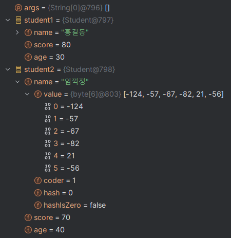

## 메모리 할당
- https://dmzld.tistory.com/40
- Student 클래스 할당 예시
  

# 객체지향 프로그래밍
- 절차적 프로그래밍(Procedural Programming)
  - 프로그램을 일련의 순서, 절차나 함수의 집합으로 보는 방식
  - 상단에서부터 하단으로 프로그램 코드를 순서대로 실행
  - 함수(Function) / 절차(Procedure)를 정의하고 호출
- 객체지향 프로그래밍(OOP : Objected-Oriented Programming)
  - 프로그램을 객체(Object)의 집합으로 보는 방식
  - 객체는 데이터(속성, 필드)과 데이터를 조작하는 기능(함수, 메서드)으로 캡슐화됨
  - 주요 4대 특징
    - 캡슐화 : 데이터와 기능을 캡슐처럼 포장
    - 상속 : 한 클래스가 다른 클래스의 특성을 상속받음
    - 다형성 : 객체 타입에 따라 다른 방식으로 작동
    - 추상화 : 복잡한 실제 세계를 단순한 모델로 표현 
- 모든 사물과 개념을 속성과 기능을 가지고 있는 객체로 단순화, 추상화 시키는 것
- 추상화 -> 모델링 : 데이터 + 행동
- 객체 지향 프로그래밍 방법이 가장 널리 사용되고 있다

## 클래스
- ../class0 | ../class1
- 객체(object)와 인스턴스(instance)의 차이
  - 클래스에서 나온 실체. 인스턴스는 클래스의 관계에 맞춰져 있음.
    - Student는 클래스다.
    - student1은 Student의 인스턴스다.
    - student1은 객체다.
- 객체를 생성하기 위한 설계도 혹은 틀, 템플릿
- 클래스의 구조
  1. Field : 객체의 데이터
  2. Constructor : 객체를 생성할 때 초기화를 담당
  3. Method : 객체가 수행하는 행동

## 객체(Object)
  - 클래스(설계도)에서 정의된대로 메모리에 할당되는 인스턴스(instance : 실례, 사례)
  - new 키워드를 통해서 객체를 생성

## 생성자
- ../class1/Contructor
- 특징
  1. 클래스 이름과 동일
  2. 리턴 타입이 없음 (void도 사용하지 않음)
  3. 오버로딩이 가능 (매개변수의 타입이나 개수에 따라 여러개 정의 가능)
- 종류
  1. 기본 생성자 : 사용자가 정의하지 않으면 컴파일러에서 자동 생성 (매개변수 없음)
  2. 사용자 정의 생성자 : 매개변수를 가지고, 객체 생성시 초기값을 전달
- this 키워드
  - 객체가 자기 자신을 가리키는데 사용되는 키워드
  - 생성자에서 매개변수와 클래스의 필드 이름이 중복되는 경우가 있을 때
  - this 키워드를 통해 둘을 구분 
    - `this.name = name`
  - this() : 다른 생성자를 호출할 때
    - 생성자 오버로딩이 있을 때 코드의 중복을 줄일 수 있음

## 패키지 
- ../package0
- 패키지 생성 규칙 및 관례
  1. 패키지는 전세계에서 유일하게 만드는 것이 좋다
     - 일반적으로 인터넷 도메인 이름을 역순으로 사용한다
     - `com.google.project.pack.abc`, `com.naver.cafe.member`
  2. 패키지 이름에는 모두 소문자만 사용한다
  3. `.`을 사용해서 계층 구조를 만든다 
  4. 예약어를 사용할 수가 없다
  5. 숫자로 시작할 수 없다

  - `package0` 상위 패키지
    - `package0.first` 하위 패키지
    - `package0.second`
  - 세 패키지는 계층 구조를 이루지만, 각각의 패키지는 서로 다른 패키지이다

## 접근제한자 Access Modifier
- ../access_modifier
1. public 
   - 어떤 클래스에서도 접근 가능
   - 사용자에게 접근을 열어두고 싶은 경우
2. protected
   - 상속 관계에서 부모 클래스가 자식 클래스에게 접근 가능 
   - 다른 패키지에 있을 경우에도
3. default (package-private)
   - 접근 제한자를 명시하지 않은 경우
   - 같은 패키지 내부에서만 접근, 사용이 가능하다
4. private
   - 해당 멤버를 선언한 클래스에서만 접근 가능 
   - 사용자에게 접근을 차단하고 싶은 경우, 내부 구현을 숨기고 싶은 경우

## Getter, Setter 메소드
- 객체지향 프로그래밍에서는 일반적으로 객체의 필드값에 외부 직접 접근을 막는다(private)
- 사용자가 개발자의 의도에 맞게 변경하거나 값을 가지고 올 수 있도록 별도의 메서드를 만든다
- 데이터의 무결성을 유지할 수 있음
- 캡슐화 원칙을 실현하고, 데이터를 보호할 수 있음
1. Getter : 필드의 안전한(제약조건, 무결성 유지하며) 읽기 `getSpeed`
2. Setter : 필드의 값을 안전하게(제약조건, 무결성 유지하며) 설정 `setSpeed`

## 자바의 메모리 영역 구조
1. 스택(Stack) 영역
    - 자바를 실행하면, 각 스레드에 의해 실행 스택이 생성되고,
    - 메서드가 호출될 때마다 메서드를 위한 스택 프레임이 생성된다.
    - 스택 프레임에서는 변수 등이 선언되고 메서드 종료시 제거된다.
2. 힙(Heap) 영역
    - 모든 객체와 배열이 생성되고 동적으로 할당되는 영역
    - 모든 스레드에서 공유가 된다
    - 더 이상 참조가 되지 않는 객체는 GC(Garbage Collector)에 의해 제거된다.
3. 메서드(Method) 영역
    - 프로그램을 실행하는데 필요한 공통 데이터를 공유하는 역할
    - 모든 스레드에 공유되고, 한 번 불러온 클래스 정보는 이 영역에 저장됨
    - 클래스의 정보, 메서드의 실행 코드, static 영역, 상수 등을 보관

- Stack 자료구조와 Queue 자료구조
  1. Stack 자료구조
    - 후입선출(LIFO : Last In First Out) 방식으로 작동
    - 마지막에 들어간 데이터가 먼저 나온다
    - 프링글스 통, 입구가 좁은 냉장고 칸
    - 활용
      - 웹브라우저의 뒤로가기 / 앞으로 가기
      - 실행 취소(Ctrl+Z) / 재실행
      - 자바의 스택 영역
    - 일반적으로 데이터 입력을 push, 출력을 pop이라고 한다
    - 데이터 삽입 예시
      - 1(push) -> 2(push) -> 3(push) -> 3(pop) -> 2(pop) -> 1(pop)
  2. Queue 자료구조
     - 선입선출(FIFO : First In First Out) 방식으로 작동
     - 먼저 들어온 데이터가 먼저 나온다
     - 식당에서 대기줄을 설때
     - 활용
       - 프린터 출력 대기 큐
     - 데이터 삽입 예시
       - 1(입력) -> 2(입력) -> 3(입력) -> 1(출력) -> 2(출력) -> 3(출력)

## 선언 위치에 따른 변수의 종류 
1. 인스턴스 변수
   - 클래스 내부에서 선언
   - 객체마다 독립적으로 존재하는 변수 (힙 영역에 매번 새로 만들어짐)
   - `static`이 붙지 않는 변수
   - 더 이상 참조하는 변수가 없을 경우 GC이 제거 (객체 소멸 시 함께 제거됨)
   - 객체의 상태를 저장하는데 사용
2. 클래스 변수
   - 클래스 내부에서 선언
   - 모든 객체에서 공유되는 변수 (메서드 영역에 저장)
   - `static`이 붙는 변수
   - 프로그램이 종료될 시 제거
   - 클래스의 공통적인 정보를 저장하는데 사용
3. 지역 변수
   - 메서드 내에서 지역적으로 사용되는 변수
   - 메서드가 종료(스택 프레임이 제거)되면서 제거
   - 매개변수(parameter)도 동일한 생명주기를 갖는다
   - 메서드와 관련된 임시적인 값을 저장할 때 사용
- 생명주기 길이 순서
  - 클래스 변수 > 인스턴스 변수 > 지역 변수

## static 키워드
- static 변수
  - 해당 클래스의 모든 인스턴스에서 공유되는 변수
  - 같은 클래스의 모든 객체는 같은 값을 갖게 됨
  - 메소드 영역에 할당
  - 메모리 사용량을 줄여서 효율성을 높일 수 있음
  - 객체 생성 없이 사용할 수 있음
- static 메소드
  - 객체 생성 없이 호출할 수 있음
  - static 메소드에서는 static 변수와 static 메소드만 접근 가능 
  - 주로 유틸리티성 함수를 작성하는데 사용된다
- static 키워드의 장점과 주의점
  - 장점 : 메모리 사용 효율화, 코드 간결성
  - 주의점 : 캡슐화를 약화시킬 수 있음. 코드 이해가 어려울 수 있음

## 상속 Inheritance
- 객체지향의 핵심 개념 중 하나
- 한 클래스가 다른 클래스의 필드와 메서드를 이어받아 사용할 수 있음
- 코드의 재사용성을 높이고, 중복을 줄이고, 구조를 체계적으로 관리할 수 있음

- 부모 클래스(Super class) : 상속을 통해 다른 클래스에 필드와 메서드를 제공
- 자식 클래스(Sub Class) : 부모 클래스로부터 필드와 메서드를 상속받는 클래스

- "is-a" 관계를 모델링한다
  - HydroCar is a Car : Dog 클래스는 Animal 클래스에게 상속 받음
  - Dog is a Animal : HydroCar 클래스는 Car 클래스에게 상속 받음
- 자바에서는 상속 대상은 하나만 선택할 수 있다
- 다중 상속은 다이아몬드 문제가 발생할 수 있어 다중상속을 허용하지 않음
- 자식 클래스는 부모 클래스를 알지만, 부모 클래스는 자식 클래스를 모른다

- 상속 관계의 메모리 구조
  - 상속 관계의 객체를 생성하면 부모와 자식이 모두 생성된다
  - 상속 관계 객체를 호출할 때, 호출자의 타입을 통해 대상 타입을 찾는다
  - 대상 타입에서 메서드를 찾지 못할 때, 부모 타입의 메서드를 찾아 실행한다
- 메서드 오버라이딩
  - 상속을 통해 얻은 메서드를 자식 클래스에서 재정의 하는 것
  - 상속받은 메서드의 구현부를 변경할 수 있다
  - 오버라이딩 조건
    - 메서드 이름이 같아야 한다
    - 매개변수가 같아야 한다
    - 접근제어자가 부모보다 같거나 넓어야 한다
  - @Override annotation을 사용한다
- 메서드 오버로딩(OverLoading)과 오버라이딩(OverRiding)의 차이
  - 오버로딩 : 같은 이름의 메서드를 여러개 정의하는 것
  - 오버라이딩 : 하위 클래스에서 상위 클래스 메서드를 재정의 하는 것
- 상속을 사용할 때 주의할 점
  1. "is-a" 관계가 성립할 때만 사용. 기타 다른 경우 예를 들어 "has-a" 관계일 
    때는 상속보다 포함(Composition)을 사용하는 것이 더 권장된다.
    - Car is a Tire. (X 상속X) Car has a Tire. (O 포함)
  2. 너무 깊은 상속 트리는 피한다
     - 코드를 이해하기 어렵고, 유지보수가 복잡해질 수 있습니다.
  3. 부모 클래스의 변경에 주의한다.
    - Super Class 변경시 모든 자식 클래스의 영향을 미친다. 
    - 코드 의존성이 증가한다.

## 다형성 (Polymorphism)
- 객체가 여러 형태를 가질 수 있는 성질
- 부모 클래스 타입의 참조 변수로 자식 클래스 타입의 객체를 참조 가능

## 인터페이스
- 메모리 구조상 클래스, 추상 클래스, 인터페이스는 동일하다
- 컴파일 될 때 `.class`파일로 컴파일 되고, 소스 코드도 `.java`로 작성된다.
- 상속과 구현
  - 부모 클래스 기능을 자식 클래스가 상속 받을 때 `extends(확장, 상속)`으로 표현하지만,
    - 부모의 기능을 물려받는 것이 목적
  - 부모 인터페이스의 기능을 자식 클래스가 상속받을 때는 `implements(구현)`으로 표현한다.
    - 물려받는 기능은 없고, 자식이 모든 메서드를 구현해야할 의무가 있음
- 인터페이스를 사용하는 이유
  1. 제약 : 추상 클래스는 본문을 가진 실행 가능한 일반 메서드가 끼어들 수 있다.
     상속받은 자식 클래스에서 기능을 구현하지 않을 수 있는 가능성이 있다.
  2. 다중 구현 가능 : 자바 클래스는 다른 상속이 불가능, 부모 클래스로 하나만 지정 가능한데,
     인터페이스는 다중 구현(다중 상속)이 가능

## 객체지향 프로그래밍
- OOP 4대 특성
  - 캡슐화, 추상화, 상속, 다형성
- OOP 5대 원칙 (SOLID)
  1. SRP : Single Responsibility Principle - 단일책임원칙
     - 하나의 클래스는 하나의 책임만 가져야 한다
  2. OCP : Open Closed Principle - 개방폐쇄원칙
     - 확장에는 열려 있어야 하지만, 수정에는 닫혀 있어야 한다
  3. LSP : Least Substitution Principle - 리스코프 치환 원칙
     - 객체는 해당 객체의 하위타입으로 치환할 수 있어야 한다
  4. ISP : Interface Segregation Principle - 인터페이스 분리 원칙
     - 필요하지 않은 인터페이스는 분리시켜야 한다
  5. DIP : Depengency Inversion Principle - 의존성 역전 원칙
     - 고수준 모듈은 저수준 모듈에 의존해서는 안되고 추상화에 의존해야 한다
     - 세부사항은 추상화에 의존해야 하고, 추상화는 세부사항에 의존해서는 안된다
- 실세계의 사물과 개념을 추상화하여 표현한 객체(Object)들의 모임, 각 
  객체(데이터와 행위)는 메시지를 주고받으며, 상호작용한다. ⇒ 객체의 협력
- 유연하고 변경이 쉬운 소프트웨어 개발 
  - 컴포넌트를 쉽고 유연하게 변경하고, 블럭을 조립하듯이 개발
- 역할(Role)과 구현(Implementation)으로 구분
  - 역할 : 객체가 시스템에서 수행하는 책임과 기능, 하나 이상의 역할 가질 수 있음
  - 구현 : 객체의 역할을 실제 코드로 구현
  - 역할과 구현을 분리하면 클라이언트에 영향을 주지 않는 변경이 가능하다
  - 인터페이스를 설계할 때 잘 설계하는 것이 필요
- 객체의 협력 : 서버와 클라이언트
  - Server : 요청을 받는 쪽 (응답 : response)
  - Client : 요청을 하는 쪽 (요청 : request)

## 예외(Exception)
- 프로그램 실행 중 발생할 수 있는 두 가지 문제
  1. Error (에러, 오류)
     - 시스템 레벨에서 발생하는 심각한 문제
     - 프로그램 외부에서 발생
     - 하드웨어 장애, 시스템 크래시, 자바가상머신 에러
     - 소스 코드로는 복구가 불가능
  2. Exception (예외)
     - 프로그램 실행 중 발생할 수 있는 일반적인 문제
     - 개발자가 코드를 통해 적절하게 처리하면 정상적인 실행을 할 수 있음
       1. Checked Exception : 컴파일 시점에 체크되는 예외
       2. Unchecked Exception : 실행 시점(Runtime)에 발생하는 예외
          - 주로 RuntimeException 클래스에서 상속받음

## Generic 의 장점
1. 타입 안정성(Type Safety)를 가짐
   - 컴파일 시점에 타입 체크를 수행할 수 있어, ClassCastException을 방지
2. 코드 재사용성이 향상
   - 다양한 타입의 데이터에 대해 재사용 가능하여, 코드의 양을 줄인다.
3. 타입 캐스팅 감소
   - 캐스팅 연산자를 사용하지 않아서 깔끔하고 가독성 향상 